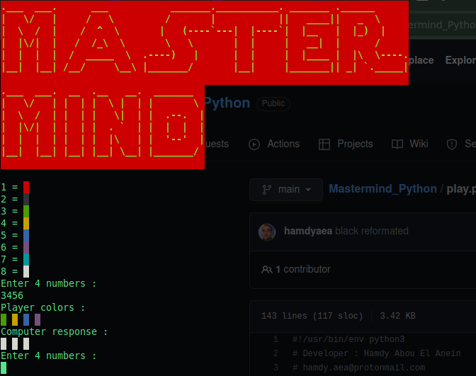

       

# Mastermind in Python3    

    

## What's this software ?     

This is a Mastermind game writed in Python3.     

    

## installation :  

1 ) The last version of Python 3.    

2 ) pip install -r requirements.txt

## How to play :     

Python play.py    

## Rules :      
  
The computer select 4 colors.   

You have to find them all to win the game.   

At every turns you have to enter 4 numbers that are equals the colors you decide.   

If one of the color EXIST in the computer selection, it show a WHITE box.   

If one of the color EXIST AND is at the right place, is show a RED box.  

## Developer - Author    

Hamdy Abou El Anein   

hamdy.aea@protonmail.com    

## Homepage

http://www.daylightlinux.ch 
